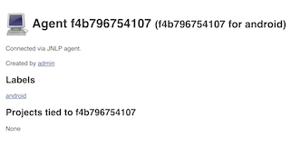

android slave for jenkins, empowered by docker
====

This is a docker image, with android sdk and jenkins slave installed. It can be used for android CI and automation testing.

usage
====
1. Following env variables must be set: **JENKINS_URL**, **JENKINS_USER**, **JENKINS_PASSWORD**
2. Following env variables are recommended: NODE_NAME (defaults to hostname), NODE_LABEL (defaults to android :D)
3. docker run -d -e "JENKINS_URL=http://your_jenkins_master:8080" -e "JENKINS_USER=admin" -e "JENKINS_PASSWORD=admin" -e "NODE_LABEL=android" __your_image__

一图胜千言

pros
====
When the container is started, it will automatically create a slave on the given jenkins, with given label as provided by NODE_LABEL.

cons
====
However, it doest support dynamical provision, eg, start container when a build/test is triggered, shut down the container when job finished. There are several plugins that supports running build in containers but either lack of certain features or is not stable ATM.

Contribute!
====
Contact qinhan#xingshulin.com
